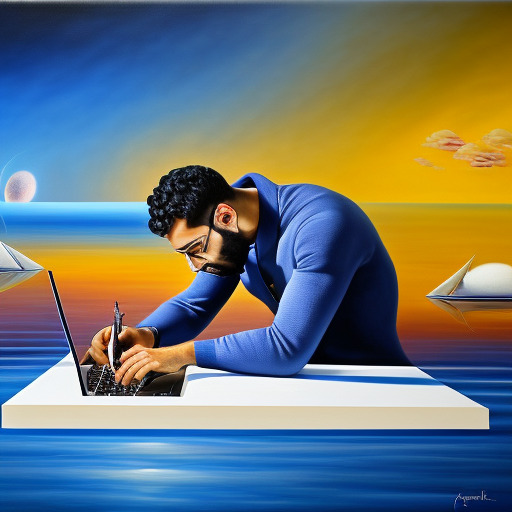

  Hi there, I'm Alejandro 👋

  

I'm a **Computational Neuroscientist** 🤖🧠 with a background in **Complex Systems** 👾➰ and **Theoretical Physics** 🌐👽. 

I'm passionate about understanding the brain and leveraging my knowledge to create impactful AI solutions.

- 🎓 Education: PhD in Applied Math
- 💼 Now working on modelling neuro-behavioral interactions through State Space Models.
- 🧠 Interests: Machine Learning, Deep Learning, Artificial Intelligence
- 🌱 I’m currently learning more about AI Safety (governance + alignment) and biologically-inspired neural networks

## ⚡ Technologies & Skills

<table><tr><td valign="top" width="33%">

### Artificial Intelligence  

  
  
  
  
</td><td valign="top" width="33%">

### Scientific programming

  
  

 

</td><td valign="top" width="33%">

### DevOps & Design

  
  

  

  
  
</td></tr></table>  

## 📫 Connect with me
 

